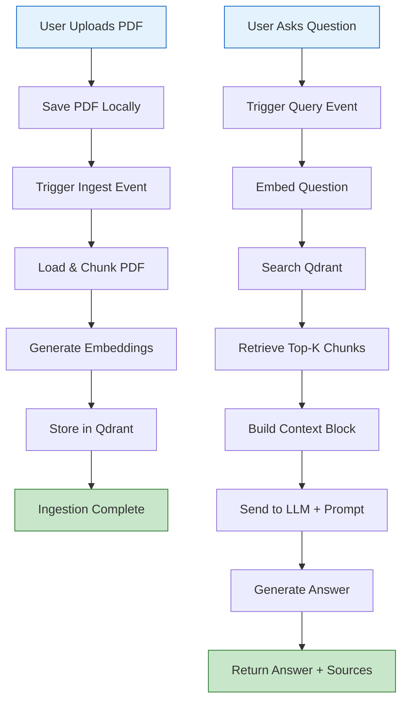
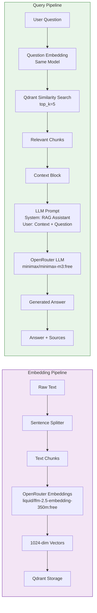
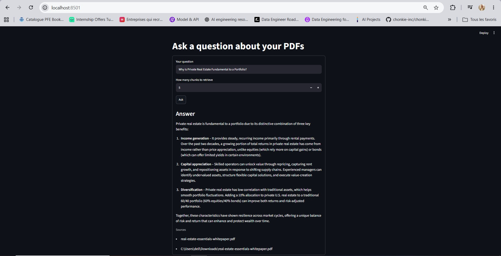

# RAG Agent: PDF Question-Answering System

A production-ready Retrieval-Augmented Generation (RAG) system that allows users to upload PDF documents and ask natural language questions about their content. Built with Streamlit, Inngest, Qdrant, and OpenRouter AI models.

## Problem & Solution

**Problem**: Users struggle to extract specific information from lengthy PDF documents, requiring manual searching and reading.

**Solution**: An intelligent PDF question-answering system that automatically processes uploaded documents, creates searchable embeddings, and uses LLMs to provide accurate, contextual answers based solely on the document content.

## Key Features

- 📄 **PDF Upload & Processing**: Drag-and-drop PDF ingestion with automatic text extraction and chunking
- 🔍 **Semantic Search**: Vector-based similarity search using Qdrant for relevant content retrieval
- 🤖 **AI-Powered Answers**: LLM-generated responses grounded in document context (no hallucinations)
- 📚 **Source Attribution**: Answers include references to source documents for verification
- ⚡ **Event-Driven Architecture**: Robust workflow orchestration using Inngest
- 🎯 **Production Ready**: Proper error handling, logging, and configuration management
- 🎨 **Intuitive Interface**: Clean Streamlit UI for seamless user experience

## Architecture / Workflow



### Detailed Workflow

#### PDF Ingestion Process
1. User uploads PDF through Streamlit interface
2. System saves PDF to local `uploads/` directory
3. Inngest event `rag/ingest_pdf` is triggered
4. PDF text is extracted and split into semantic chunks (400 tokens with 50 overlap)
5. Chunks are embedded using OpenRouter's `liquid/lfm-2.5-embedding-350m:free` model
6. Embeddings with metadata are stored in Qdrant vector database
7. System confirms successful ingestion

#### Question Answering Process
1. User enters question through Streamlit interface
2. Inngest event `rag/query_pdf_ai` is triggered
3. Question is embedded using the same embedding model
4. Similarity search performed against Qdrant (configurable top_k, default 5)
5. Retrieved chunks form context block for the LLM
6. Context + question sent to LLM via OpenRouter (`minimax/minimax-m3:free`)
7. LLM generates answer strictly based on provided context
8. System returns answer along with source document references

## AI/LLM Pipeline



### Prompt Engineering
The system uses a carefully crafted prompt to ensure quality responses:

```
Use the following context to answer the question.

Context:
{context_block}

Question:
{question}

Instructions:
- Answer using only the provided context.
- Do not use outside knowledge.
- If the answer is not contained in the context,
  say: "I don't have enough information in the provided documents."
- Keep the answer concise.
```

## Tech Stack

### Frontend
- **Streamlit**: Interactive web interface for PDF upload and questioning

### Backend & Orchestration
- **Inngest**: Event-driven workflow engine for reliable function execution
- **FastAPI**: Web framework for Inngest API endpoints

### AI/ML Components
- **OpenRouter API**: Unified access to multiple LLM providers
  - Embedding: `liquid/lfm-2.5-embedding-350m:free` (1024 dimensions)
  - LLM: `minimax/minimax-m3:free` (text generation)
- **LlamaIndex**: 
  - PDFReader: Text extraction from PDF files
  - SentenceSplitter: Intelligent text chunking with overlap
- **Qdrant**: Vector similarity search for efficient retrieval

### Infrastructure
- **Qdrant**: Vector database for storing and searching embeddings
- **Python 3.13+**: Core runtime environment

### Dependencies
See [`pyproject.toml`](pyproject.toml) for complete dependency list:
- `fastapi>=0.140.7`
- `inngest>=0.5.19`
- `llama-index-core>=0.14.23`
- `llama-index-readers-file>=0.6.0`
- `openai>=2.48.0` (for OpenRouter compatibility)
- `python-dotenv>=1.2.2`
- `qdrant-client>=1.18.0`
- `streamlit>=1.60.0`
- `uvicorn>=0.51.0`

## Project Structure

```
rag-agent/
├── .env                  # Environment variables (API keys, configs)
├── .gitignore           # Git ignore rules
├── .python-version      # Python version specification
├── main.py              # Inngest workflow functions & FastAPI app
├── streamlit_app.py     # Streamlit frontend interface
├── data_loader.py       # PDF processing & embedding generation
├── vector_db.py         # Qdrant vector database operations
├── custom_types.py      # Pydantic data models for type safety
├── test_openai.py       # API connectivity test
├── pyproject.toml       # Project dependencies & metadata
├── RAG_Flow.codediagram # Architecture diagram (exported)
├── uploads/             # Directory for uploaded PDFs
└── qdrant_storage/      # Qdrant local storage data
```

## Installation & Setup

### Prerequisites
- Python 3.13 or higher
- Git (for cloning the repository)
- Qdrant running locally on docker (default: `http://localhost:6333`)
- Inngest dev server running locally (default: `http://127.0.0.1:8288/v1`)

### Quick Start

1. **Clone the repository**
   ```bash
   git clone <repository-url>
   cd rag-agent
   ```

2. **Set up virtual environment**
   ```bash
   python -m venv .venv
   # On Windows:
   .venv\Scripts\activate
   # On macOS/Linux:
   source .venv/bin/activate
   ```

3. **Install dependencies**
   ```bash
   pip install -e .
   ```

4. **Configure environment variables**
   Copy the example environment and add your API keys:
   ```bash
   cp .env.example .env  # If example exists, otherwise create .env
   ```
   Edit `.env` to include:
   ```env
   OPENROUTER_API_KEY=your_openrouter_api_key_here
   INNGEST_API_BASE=http://127.0.0.1:8288/v1
   ```

5. **Start required services**
   ```bash
   # In one terminal - Start Qdrant (using Docker)
   docker run -p 6333:6333 qdrant/qdrant
   
   # In another terminal - Start Inngest dev server
   inngest dev : npx inngest-cli@latest dev -u http://127.0.0.1:8000/api/inngest --no-discovery
   
   # In another terminal - Start the FastAPI backend
   uvicorn main:app --reload
   
   # In another terminal - Start the Streamlit frontend
   streamlit run streamlit_app.py
   ```

6. **Access the application**
   Open your browser to `http://localhost:8501`

## Environment Variables

| Variable | Description | Example/Default |
|----------|-------------|-----------------|
| `OPENROUTER_API_KEY` | API key for OpenRouter service (required) | `sk-or-v1-...` |
| `INNGEST_API_BASE` | Base URL for Inngest API | `http://127.0.0.1:8288/v1` |
| `QDRANT_URL` | Qdrant server URL (optional) | `http://localhost:6333` |
| `QDRANT_COLLECTION` | Qdrant collection name (optional) | `docs` |

> **Security Note**: Never commit your `.env` file containing API keys to version control. The provided `.gitignore` prevents accidental exposure.

## How to Run

### Development Mode
```bash
# Terminal 1: Qdrant
docker run -p 6333:6333 qdrant/qdrant

# Terminal 2: Inngest
inngest dev

# Terminal 3: Backend API
uvicorn main:app --reload

# Terminal 4: Frontend UI
streamlit run streamlit_app.py
```

### Production Deployment
For production deployment, consider:
1. Using managed Qdrant service (Qdrant Cloud)
2. Deploying Inngest to production environment
3. Using proper process managers (PM2, Docker Compose, Kubernetes)
4. Setting up reverse proxy (NGINX) for Streamlit
5. Implementing proper logging and monitoring

## API Endpoints

The system exposes endpoints primarily through Inngest event handling:

### Inngest Events

#### `rag/ingest_pdf`
**Trigger**: PDF upload completion
**Payload**:
```json
{
  "pdf_path": "/absolute/path/to/uploaded/file.pdf",
  "source_id": "filename.pdf"
}
```
**Response**: 
```json
{
  "ingested": 15
}
```
Where `ingested` is the number of text chunks processed and stored.

#### `rag/query_pdf_ai`
**Trigger**: User submits question
**Payload**:
```json
{
  "question": "What is the main topic of the document?",
  "top_k": 5
}
```
**Response**:
```json
{
  "answer": "The document discusses...",
  "sources": ["filename.pdf"],
  "num_contexts": 5
}
```

## Docker / Deployment

While not currently containerized, the application can be easily Dockerized. A suggested `docker-compose.yml` for development:

```yaml
version: '3.8'
services:
  qdrant:
    image: qdrant/qdrant
    ports:
      - "6333:6333"
    volumes:
      - qdrant_storage:/qdrant/storage
  
  inngest:
    image: inngest/inngest
    ports:
      - "8288:8288"
    environment:
      - INNGEST_DEV_SERVER_ENABLED=true
  
  backend:
    build: .
    ports:
      - "8000:8000"
    volumes:
      - .:/app
      - uploads:/app/uploads
    environment:
      - OPENROUTER_API_KEY=${OPENROUTER_API_KEY}
      - INNGEST_API_BASE=http://inngest:8288/v1
    depends_on:
      - qdrant
      - inngest
  
  frontend:
    build: .
    ports:
      - "8501:8501"
    volumes:
      - .:/app
      - uploads:/app/uploads
    environment:
      - OPENROUTER_API_KEY=${OPENROUTER_API_KEY}
    depends_on:
      - backend

volumes:
  qdrant_storage:
  uploads:
```

## Screenshots / Demo

## 📸 Application

<p align="center">
  
</p>
<br />
<p align="center">
  
</p>
<br />
<p align="center">
  
</p>

## Future Improvements

### Short-term
- [ ] Add document listing and management UI
- [ ] Implement chat history for continuous conversations
- [ ] Add file type support beyond PDF (DOCX, TXT, MD)
- [ ] Improve error handling and user feedback
- [ ] Add configuration UI for chunk size, top_k, etc.

### Medium-term
- [ ] Add user authentication and document privacy controls
- [ ] Implement hybrid search (keyword + vector)
- [ ] Add re-ranking of retrieved results
- [ ] Support for multiple languages
- [ ] Add document summarization feature

### Long-term
- [ ] Deploy to cloud platforms (AWS, GCP, Azure)
- [ ] Add monitoring and analytics dashboard
- [ ] Implement batch processing for multiple documents
- [ ] Add API key management and rate limiting
- [ ] Support for custom LLM models and embedding providers

## License

This project is licensed under the MIT License - see the [LICENSE](LICENSE) file for details.

## Acknowledgments

- Built with [Streamlit](https://streamlit.io)
- Powered by [Inngest](https://inngest.com) for reliable workflows
- Vector search enabled by [Qdrant](https://qdrant.tech)
- Document processing with [LlamaIndex](https://docs.llamaindex.ai)
- AI models provided via [OpenRouter](https://openrouter.ai)

---

*Developed with ❤️ for efficient document intelligence*